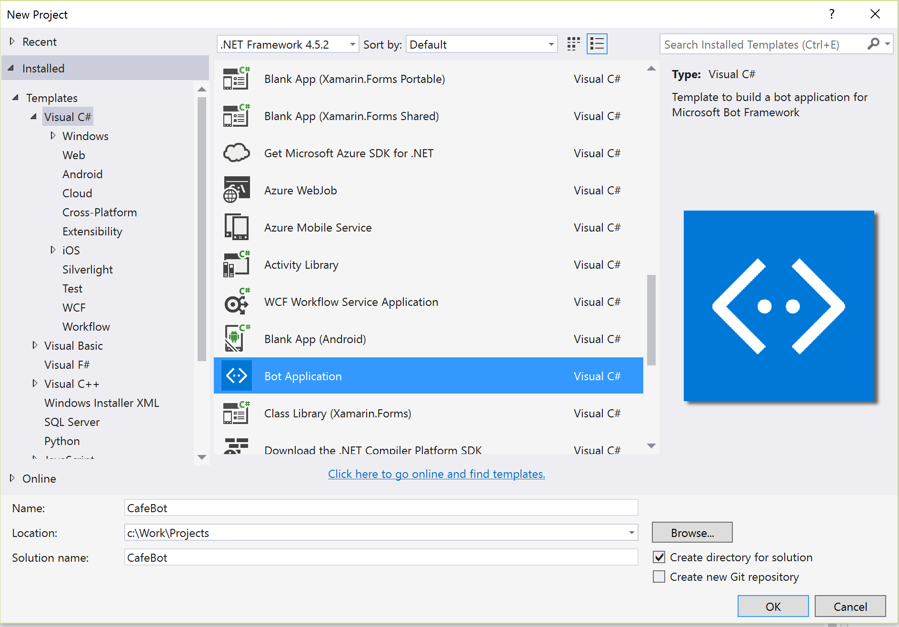
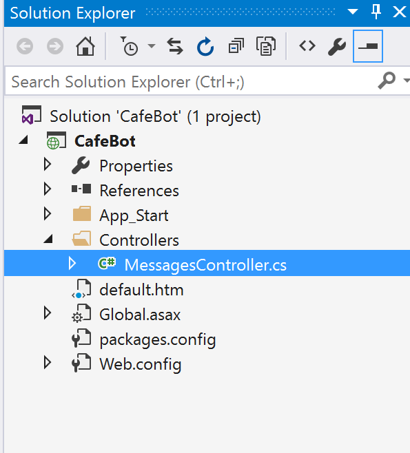
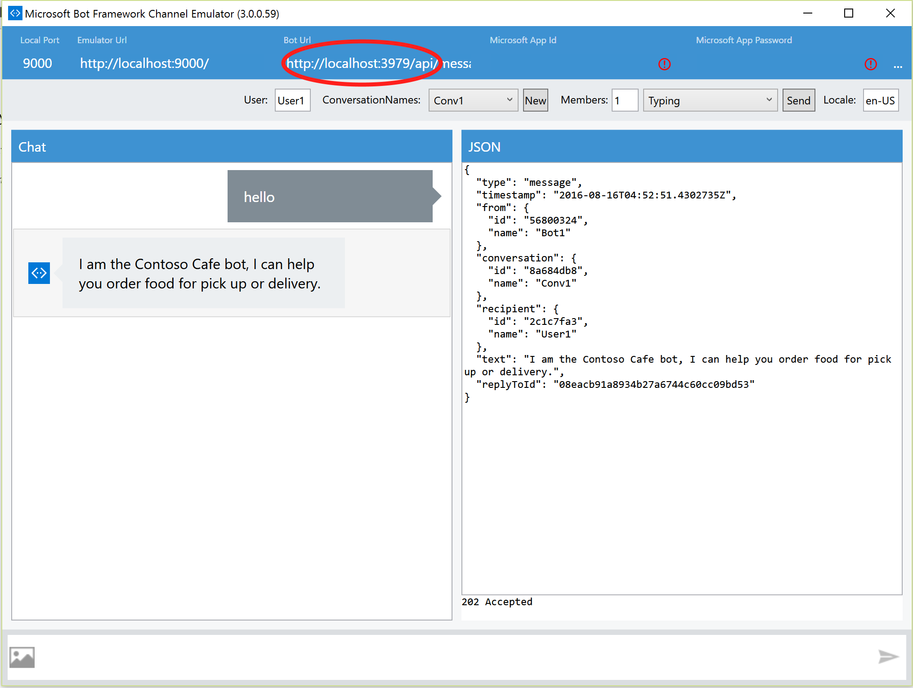
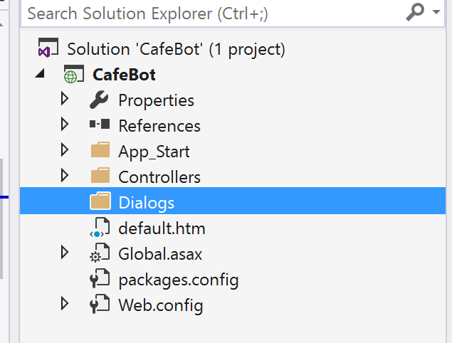
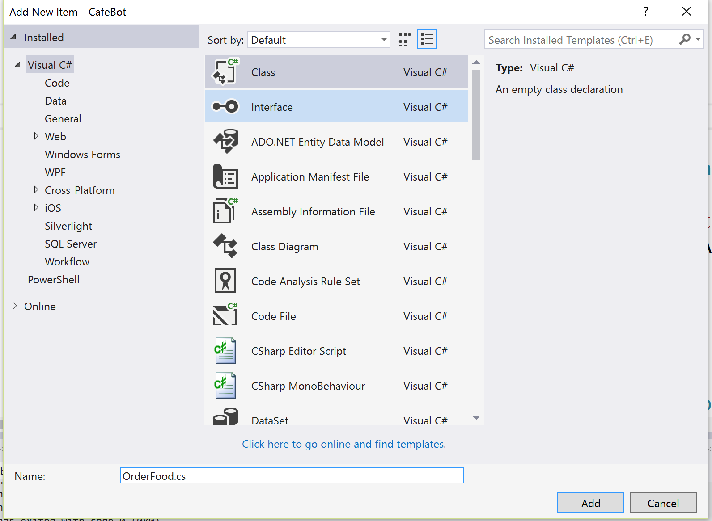
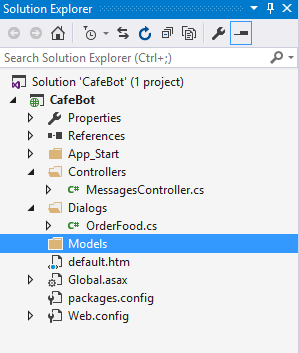
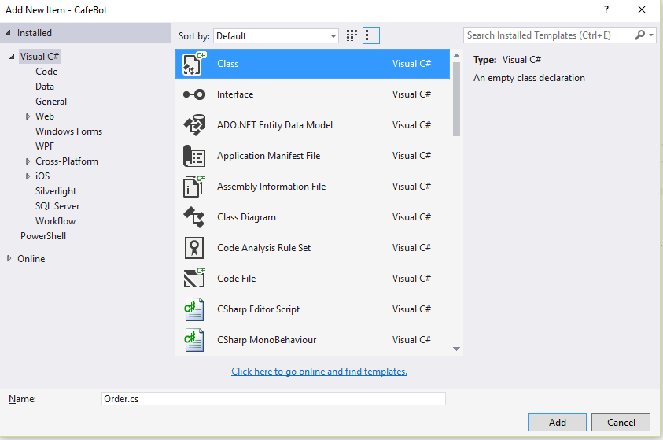
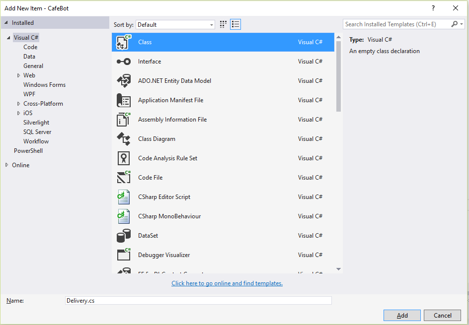
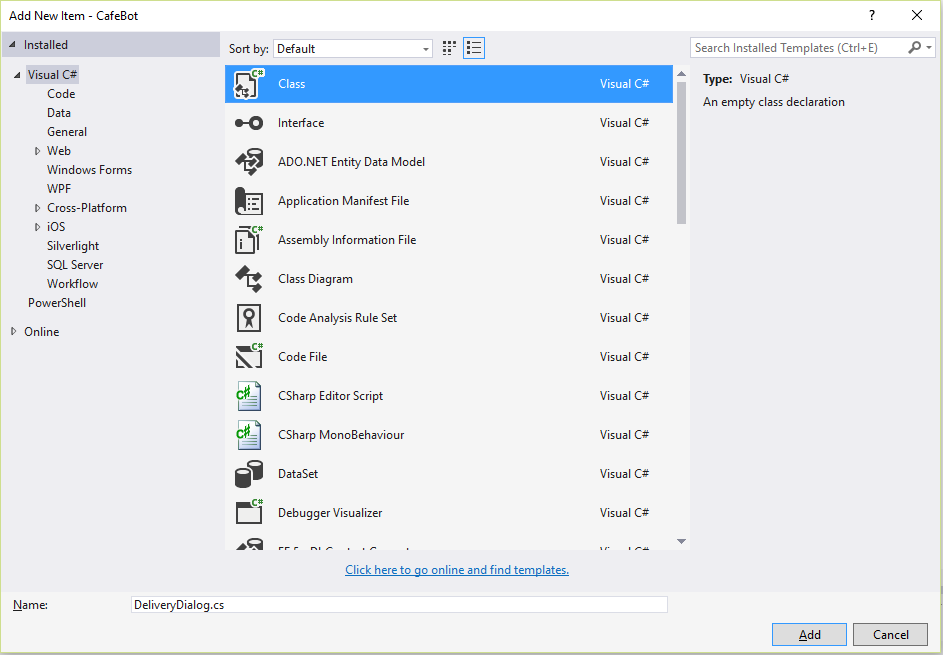

#Getting Started With the BOT framework

The Microsoft Bot Framework provides a platform for you to build interactive conversational Bots. The Bots you build can support multiple end points, or channels. A channel is the way people will engage with the Bot you build. Examples of channels are Skype, SMS, Slack, Kik, and Facebook Messenger.  

In this tutorial you will learn how to build a food ordering Bot for Contoso Café. The Contoso Café app is designed to demonstrate the basic features of a food ordering application. The Contoso Café application has a hard coded list of food in its menu, supports a basic shopping cart, and check out feature. The payment feature is left incomplete intentionally as it is not important for this tutorial.

In this tutorial, you will build a new Bot that will help people order food. You learn the different ways that a Bot can interpret the requests being made to it.

The software you build is acting as an end point for people to have a conversation. To help people feel comfortable conversing with the Bot you want to make the conversation feel natural.

This is a step-by-step guide to writing an Bot in C# using the Bot Framework Connector SDK .NET template.

1. Install prerequisite software◦Visual Studio 2015 (latest update), you can download the community version here for free: www.visualstudio.com
Important: Please update all VS extensions to their latest versions Tools->Extensions and Updates->Updates

2. Download and install the Bot Application template.
Download the file from the direct download link [here](http://aka.ms/bf-bc-vstemplate)
Save the zip file (do not extract the contents) to your Visual Studio 2015 templates directory which is traditionally in "%USERPROFILE%\Documents\Visual Studio 2015\Templates\ProjectTemplates\Visual C#\"

3. Open Visual Studio
4. Create a new C# project using the new Bot Application template.
5. Name the new project CafeBot

    
   Figure 1 Create a new Bot Project

6. In **Solution Explorer** browse to the *MessagesController.cs* class and select it in order to browse the code file

    
   Figure 2 Open the MessagesController.cs file

7. The first method in the MessagesController class is called Post. The Post method recieves input from the person with whom the Bot is conversing and returns a response. This is the place you have an opportunity to respond. The default code in this method counts the length of the message text sent to the Bot and responds with the message and the length. Edit the code to return a single line of text.
```cs
public async Task<HttpResponseMessage> Post([FromBody]Activity activity)
{
    if (activity.Type == ActivityTypes.Message)
    {
        ConnectorClient connector = new ConnectorClient(new Uri(activity.ServiceUrl));

        Activity reply = activity.CreateReply($"I am the Contoso Cafe bot, I can help you order food for pick up or delivery.");
        await connector.Conversations.ReplyToActivityAsync(reply);
    }
    else
    {
        HandleSystemMessage(activity);
    }
    var response = Request.CreateResponse(HttpStatusCode.OK);
    return response;
}
```
8. To test your Bot you need to be able to run it locally on your PC. You can do this in Visual Studio and use the Bot Framework Channel Emulator. You can download the Emulator from [here](https://aka.ms/bf-bc-emulator)
Run the Bot in Visual Studio, **Debug | Start Debugging (F5)**. This will launch a browser on a localhost port. Make a note of the port.


Figure 3 Run the Bot on localhost and note the port

9. Run the Emulator and ensure it is pointing the correct port. Then start a conversation with the Bot. You will notice the conversation is somewhat boring at this point.

   
   Figure 4 Run the emulator and ensure the port is correct


At this point you could extend the Post method to determine the response from the Bot. This would end up creating some complex code with decision trees for responses.
The Bot framework provides a concept called a Dialog. A Dialog helps you manage a conversation.
In this next exercise you will create a simple dialog.  


10. In **Solution Explorer** right click on the project and from the popup menu select **Add | New Folder**. Rename the folder to *Dialogs*

    
   Figure 5 Add the Dialog Folder

11. Right click on the new Dialogs folder and in the context menu select **Add | Class...**

12. Name the class *OrderFood* and select **Add**

    
   Figure 6 Add the Order

13. The OrderFood.cs file should open in Visual Studio and you can edit the class as shown below. Firstly support the *IDialog<T>* interface and add the *StartAsync* and *MessageRecievedAsync* methods.


```cs
using Microsoft.Bot.Builder.Dialogs;

...

[Serializable]
public class OrderFood : IDialog<object>
{
    public async Task StartAsync(IDialogContext context)
    {
        context.Wait(MessageReceivedAsync);
    }

    public async Task MessageReceivedAsync(IDialogContext context, IAwaitable<IMessageActivity> argument)
    {
        await context.PostAsync("I am the Contoso Cafe bot, I can help you order food for pick up or delivery.");

        context.Wait(MessageReceivedAsync);
    }
}
```   

14. In the MessagesController.cs code file edit the Post method to call the OrderFood Dialog.

```cs
using Microsoft.Bot.Builder.Dialogs;
using CafeBot.Dialogs;
using.Microsoft.Bot.Connector;
using.System.Threading.Tasks;
...

public async Task<HttpResponseMessage> Post([FromBody]Activity activity)
{
    if (activity.Type == ActivityTypes.Message)
    {
        await Conversation.SendAsync(activity, () => new OrderFood());
    }
    else
    {
        HandleSystemMessage(activity);
    }
    var response = Request.CreateResponse(HttpStatusCode.OK);
    return response;
}
```

15. Run the Bot in Visual Studio, **Debug | Start Debugging (F5)**.

In the Emulator you can now chat to the Bot, it is still a rather boring conversation.  You need a way to create a decision tree for the Bot to walk the customer through a set of options. In the next part of this exercise you will create a Dialog class to support menu choices.

16. In **Solution Explorer** right click on the project and from the popup menu select **Add | New Folder**. Rename the folder to *Models*

    
   Figure 7 Add the Models Folder


17. In Solution Explorer right click on the new Models folder and in the context menu select **Add | Class...**

18. Name the class *Order* and select **Add**

    
   Figure 8 Add the Order

19. The Order.cs file should open in Visual Studio and you can edit the class as shown below. The enumerated types will be used to provide options in the food order. You will notice that the enumerated types are all set to start at 1 (rather than the default of 0), this is because the enum value of 0 is not used by the Bot framework when you generate a Form using this class.

```cs
namespace CafeBot.Models
{
    public enum Drinks
    {
        None = 1, Americana, Espresso, Lemonade, Water, OrangeJuice, Cola
    };

    public enum Snacks
    {
        None = 1, ChoclateCookie, FrenchFries,
    };

    public enum Food
    {
        None = 1, BreakfastQuiche, Omelette, VegieWrap, ChickenSandwich, BigBurger
    }

    public enum DeliveryOption
    {
        Pickup = 1, Delivery
    }

    [Serializable]
    public class Order
    {
        public List<Drinks> Drinks;
        public List<Snacks> Snacks;
        public List<Food> Meal;
        public DeliveryOption DeliveryOption;
    }
}

```

20. Return to the *MessagesController* class and add a method to create a Bot Form from the Order class

```cs

using Microsoft.Bot.Builder.FormFlow;
using CafeBot.Models;
...

    public static IForm<Order> BuildOrderForm()
    {
        return new FormBuilder<Order>()
                .Message("Welcome to the Contoso Cafe order bot!")
                .Build();
    }

```

21. Edit the Post method in the *MessagesController* class to use this new Order Form. The method you defined in the previous step creates a form from the class with public fields used to define the options.
The new method you add below creates a Dialog from that Form for use in a conversational Bot.

```cs
    public async Task<HttpResponseMessage> Post([FromBody]Activity activity)
    {
        if (activity.Type == ActivityTypes.Message)
        {
            await Conversation.SendAsync(activity, ()=> FormDialog.FromForm(BuildOrderForm));
        }
        else
        {
            HandleSystemMessage(activity);
        }
        var response = Request.CreateResponse(HttpStatusCode.OK);
        return response;
    }

```

22. Run the Bot in Visual Studio, **Debug | Start Debugging (F5)**.

In the Emulator you can now chat to the Bot and make a selection from food orders. You will see that the options from the enumerated types are provided as a choice to the person chatting to the Bot.
In the next exercise you will capture the address for delivery if the customer has requested the order be delivered.

23. In Solution Explorer right click on the new Models folder and in the context menu select **Add | Class...**
 Name the class *Delivery* and select **Add**

    
   Figure 9 Add the Delivery Class

24. In the code for the Delivery class add an Order and a string field for the Address

```cs
namespace CafeBot.Models
{
    [Serializable]
    public class Delivery
    {
        public Order Order;
        public string Address;
    }
}
```

25. In **Solution Explorer** right click on the Dialogs folder and in the context menu select **Add | Class...**

26. Name the class *DeliveryDialog* and select **Add**

    
   Figure 10 Add the DeliveryDialog class

27. The DeliveryDialog.cs file should open in Visual Studio and you can edit the class as shown below. Firstly support the *IDialog<T>* interface and add the *StartAsync* and *MessageRecievedAsync* methods.
Take note that the constructor takes an Order and the Dialog is going to return a Delivery.
When the Dialog is started it determines if this Order is for a delivery (rather than pickup), and if so then requests an address.

```cs
using CafeBot.Models;
using Microsoft.Bot.Builder.Dialogs;
using System;
using System.Threading.Tasks;
using Microsoft.Bot.Connector;

namespace CafeBot.Dialogs
{
    [Serializable]
    public class DeliveryDialog : IDialog<Delivery>
    {
        Delivery delivery;

        public DeliveryDialog(Order o)
        {
            delivery = new Delivery() { Order = o };
        }

        public async Task StartAsync(IDialogContext context)
        {
            if (delivery.Order.DeliveryOption == DeliveryOption.Delivery)
            {
                if (null == delivery.Address)
                {
                    string response = "Please tell me the address where would like this order delivered";

                    await context.PostAsync(response);

                    context.Wait(MessageReceivedAsync);
                }
                else
                {
                    context.Done(delivery);
                }
            }
            else
            {
                context.Done(delivery);
            }
        }

        private async Task MessageReceivedAsync(IDialogContext context, IAwaitable<IMessageActivity> argument)
        {
            IMessageActivity activity = await argument;

            if (null != activity)
            {
                delivery.Address = activity.Text;
                context.Done(delivery);
            }
        }

    }
}
```

28. You now need some mechanism to join the result from the first Dialog (the Order Form) to the DeliveryDialog. This can be done by using a Chain.
In the MessagesController class add a new method called MakeRootDialog that will start a chain of dialogs.

```cs
    internal static IDialog<Delivery> MakeRootDialog()
    {
        return Chain.From(() => FormDialog.FromForm(BuildOrderForm))
            .ContinueWith<Order, Delivery>(async (ctx, r) =>
            {
                Order o = await r;
                return new DeliveryDialog(o);
            }) ;
    }
```

29. Call this method from the Post method to start the conversation with the Order Form and then continue with the DeliveryDialog.

```cs
    public async Task<HttpResponseMessage> Post([FromBody]Activity activity)
    {
        if (activity.Type == ActivityTypes.Message)
        {
            await Conversation.SendAsync(activity, MakeRootDialog);
        }
        else
        {
            HandleSystemMessage(activity);
        }
        var response = Request.CreateResponse(HttpStatusCode.OK);
        return response;
    }
```

30. Run the Bot in Visual Studio, **Debug | Start Debugging (F5)**.

In the Emulator you can now chat to the Bot and make a selection from food orders and then if a delivery is chosen enter your address.
It would be good if the Bot could then confirm the details. You will next add a new dialog to confirm the details of the delivery.

31.  In **Solution Explorer** right click on the Dialogs folder and in the context menu select **Add | Class...**
Name the class CompletedDialog.cs and select **Add**

32. This class will implement the IDialog interface again, this time it will both recieve and return a Delivery object.

```cs
using.Microsoft.Bot.Builder.Dialogs;
using.System.Threading.Tasks;
using.CafeBot.Models;
...

    [Serializable]
    public class CompletedDialog : IDialog<Delivery>
    {
        private Delivery delivery;

        public CompletedDialog(Delivery d)
        {
            delivery = d;
        }

        public async Task StartAsync(IDialogContext context)
        {
            string response = $"Thank you for your order";
            await context.PostAsync(response);
            if (delivery.Order.DeliveryOption == DeliveryOption.Pickup)
            {
                response = $"It will be ready for collection in 20 minutes";
                await context.PostAsync(response);
            }
            else
            {
                response = $"It will be delivered to {delivery.Address} within the next 45 minutes";
                await context.PostAsync(response);
            }
            context.Done(delivery);
        }
    }
```

33. This new Dialog needs to be added to the Chain of dialogs being used by this Bot. Return to the MessagesController class and edit the MakeRootDialog method to add the CompletedDialog to the end of the Chain.

```cs
    internal static IDialog<Delivery> MakeRootDialog()
    {
        return Chain.From(() => FormDialog.FromForm(BuildOrderForm))
            .ContinueWith<Order, Delivery>(async (ctx, r) =>
            {
                Order o = await r;
                return new DeliveryDialog(o);
            })
            .ContinueWith<Delivery, Delivery>(async (ctx, r) =>
            {
                Delivery d = await r;
                return new CompletedDialog(d);
            }) ;
    }
```

34. Run the Bot in Visual Studio, **Debug | Start Debugging (F5)**.

In the Emulator you can now chat to the Bot and once you have made an order you will be shown a summary of the order with a time for pickup or delivery.

In this document you have learned how to build a Bot using the Bot Framework. You have learned to a Bot can respond to simple input, and how to create a menu selection system using Dialogs and Forms. You have also learned how to connect the output from one Dialog to the input of the next Dialog.


**Exercises to extend this Bot.**

1. Ask the customer for the number of drinks and food items they want, how would you order 2 Cola's and a Lemonade ?

2. Consider how you might enable the Bot to support the booking of a table in the cafe (there is another document that does some of this)

3. How could you remember the last order made by a customer, and also remember a customer's delivery address.


#References


[The Bot Framework documentation](https://docs.botframework.com/)

[The Bot Framework downloads](https://docs.botframework.com/downloads/)
