#Getting Started With LUIS for the BOT framework

LUIS, or the Language Understandering Intelligent Service, is a ready made machine learning service provided by Microsoft to help you build software that can understand human language commands. This will help you create applications and websites that can interact in more natural ways with your customers. 

In this tutorial you will learn how to extend the food ordering Bot for Contoso Café to support some natural language input. The instrunction on how to build this Contoso Cafe Bot can be found in another guide. You can also start from the code provided. 
  
A Bot is an ideal place to implment a natural language interface. It will enable your customers to interact with the Bot in a more conversational manner.

This is a step-by-step guide to extending a Bot in C# using the Bot Framework Connector SDK .NET template and LUIS.

**Prerequisites** 

Visual Studio 2015 (latest update), you can download the community version here for free: www.visualstudio.com
Important: Please update all VS extensions to their latest versions Tools->Extensions and Updates->Updates

Download and install the Bot Application template. 
Download the file from the direct download link [here](http://aka.ms/bf-bc-vstemplate) 
Save the zip file (do not extract the contents) to your Visual Studio 2015 templates directory which is traditionally in "%USERPROFILE%\Documents\Visual Studio 2015\Templates\ProjectTemplates\Visual C#\"

**Create a LUIS Application**

1. In a modern up to date Browser navigate to the [LUIS website](http://www.luis.ai/)

2. Log in using your Microsoft Account. If this is the first time you have logged in your will have to answer some simple questions.
You will be presented with a web page titled LUIS: My Applications

 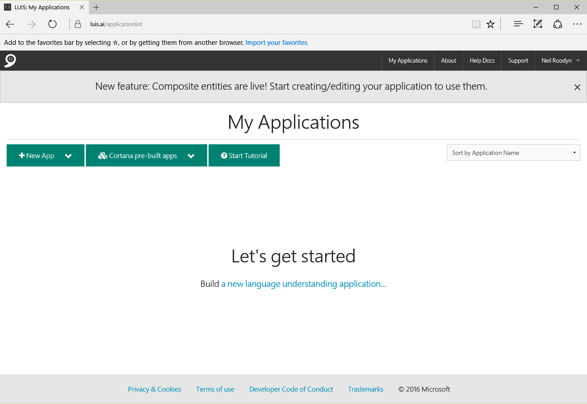   
   Figure 1 LUIS Applications Page 

3. Click on the New App button and select 'New Application' from the menu.

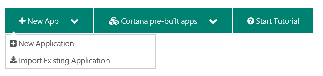   
   Figure 2 Create a new application 

4. In the *Add a New Application* dialog give your app a **name** and set the usage scenario as **Bot** . You can select application domains and make sure the culture is set to one that works for you. You will need to select a domain, select Shopping. Click on the **Add App** button in the bottom right corner.

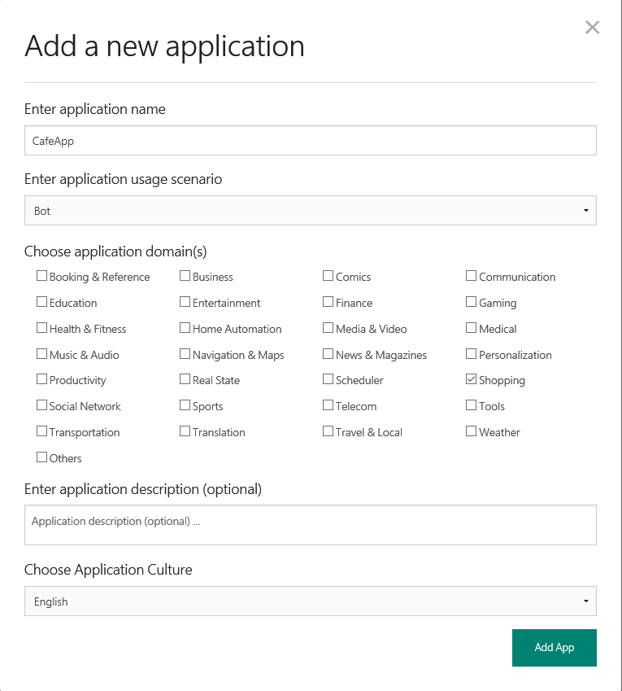   
   Figure 3 Add application information 

5. You will now see a page for your app. Here you can create a language model to train the service about your application. First you will create an intent. An intent is an action that you would like your customers to be able to trigger through a natural language command. You will start with the OrderFood action.
Click on the Add Intents button, show in figure 4.

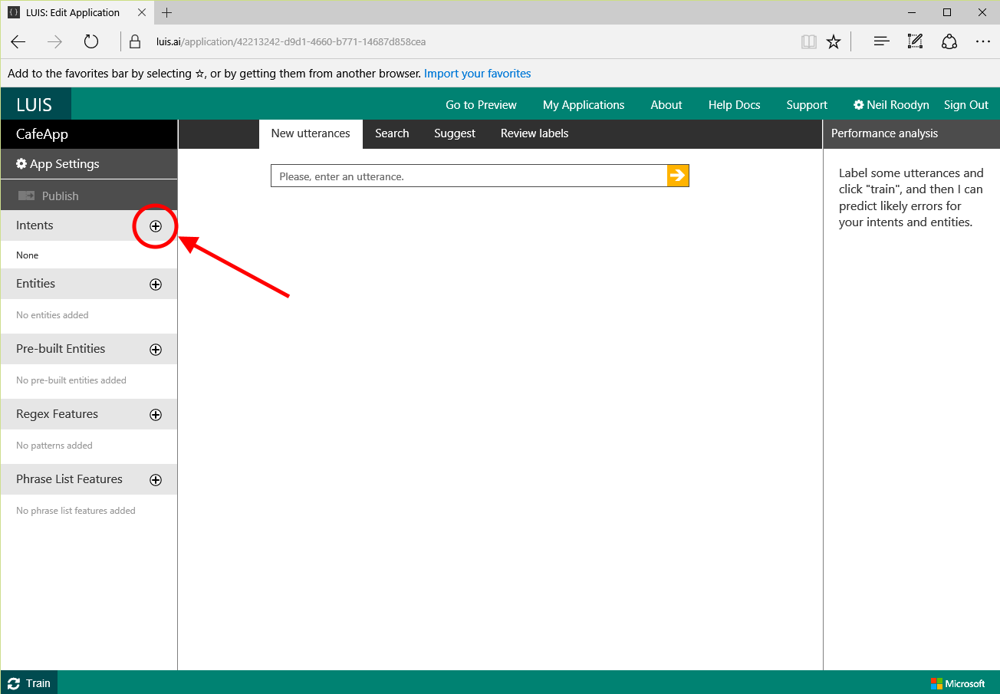   
   Figure 4 Add Intent 

6. In the **Add a new intent** dialog enter the name as *OrderFood* and enter a command that would be given to trigger that intent, for example *I would like to order some food*. Then click the Save button.

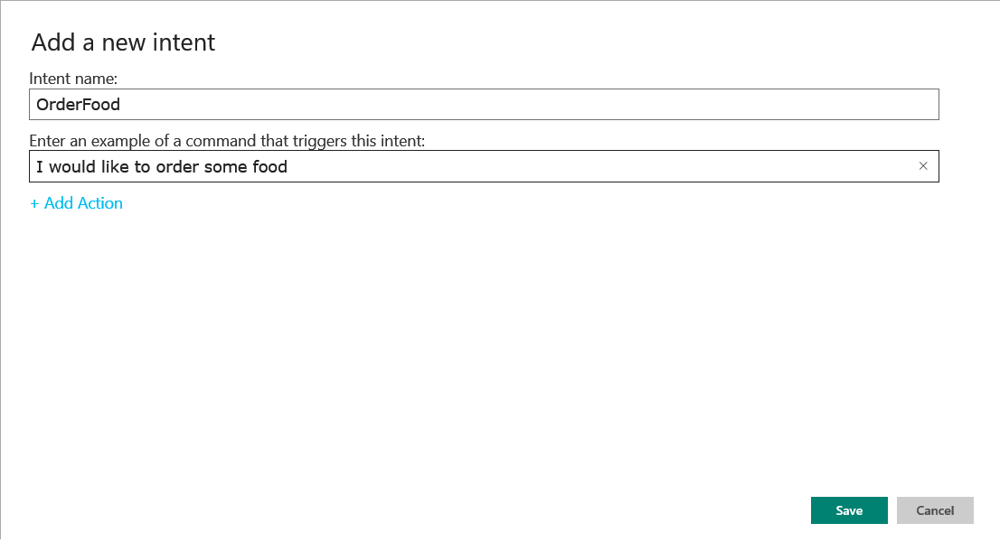   
   Figure 5 Set the intent name

7. You are now presented with a page populated with the phrase you gave as an example to trigger the intent. This is called an **utterance**. In order to improve the ability of the service to understand natural language you need to provide a number of utterances. An utterance is an example phrase that a person might use when they wish the intent to be triggered. The more utterances you provide the better your app will be able to respond correctly.
Start by clicking **Submit** for this utterance. 

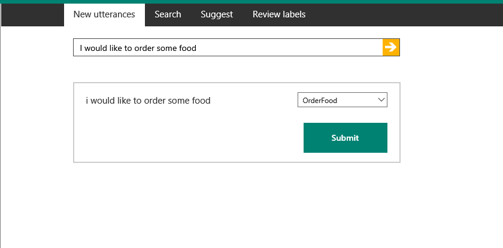   
   Figure 6 Submit an utterance

8. Now enter some more *utterances* that might be used by people who wish to order food and submit them. Make sure you select the OrderFood intent in the drop down on this page. Add at least 5 more utterances. As the app gets better at understanding the intent it should start to populate the Intent drop down with OrderFood. 

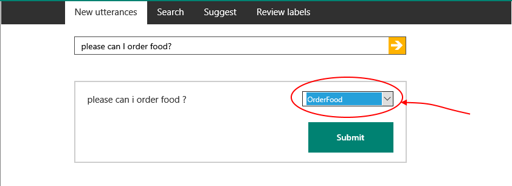   
   Figure 7 Submit more utterances

9. You can see a Performance Analysis of the utterances you are entering shown on the right hand side of the web page 

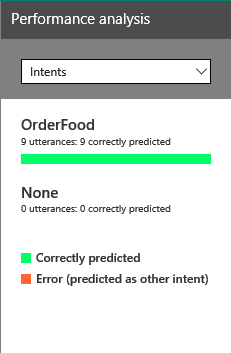   
   Figure 8 Performance Analysis

10. An entity is a component of an utterance (or phrase) that has value to you in your app. For example when you order food, you might want it for a certain time. To add an entity you can either create your own or use one of the pre-built entities. In this exercise you are going to use the Pre-Built Entities. On the left hand side of the web page click the button to add a Pre-built entity

   
   Figure 9 Add a Pre-Built Entity

11. From the dialog, scroll down and select the datetime entity. This will help you to identify date and time compnenents in an utterance and pass that on to your application. Select datetime and click **OK**

   
   Figure 10 Add the datetime Entity

12. Back in the utterance screen add a phrase to order food for a time, for example *order my lunch for tomorrow*.
You will see that the word tomorrow is hightlighted and if you hover over it, it has been marked as a datetime entity. Click **Submit** to add this utterance to the training materials for your new app.

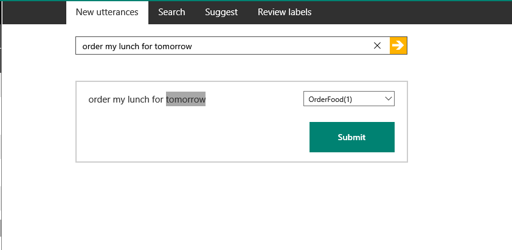
   Figure 11 Add an utterance with an entity

13. Using the same steps as above create a new Intent called BookTable. This will be for people that would like to book a table. An example utterance would be something like "I would like to book a table"

14. Add *number* as another pre-built entity. You should now use this to start marking table booking utterances for the number of guests. For example *Please book a table for 4 people tomorrow at 7pm*

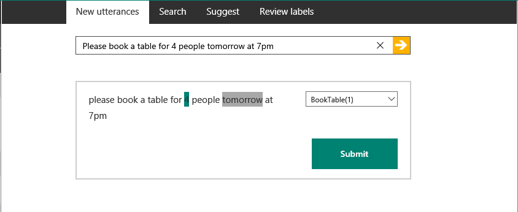
   Figure 12 Add a Table Booking Utterance

15. Once you have a number of utterances entered for both BookTable and OrderFood intents, you can publish the LUIS app so you can use it in your Bot. At the top left side of the page you will see a Publish button. Click the Publish button and a dialog will appear, click the Publsh App button and a URL for the service will be displayed.

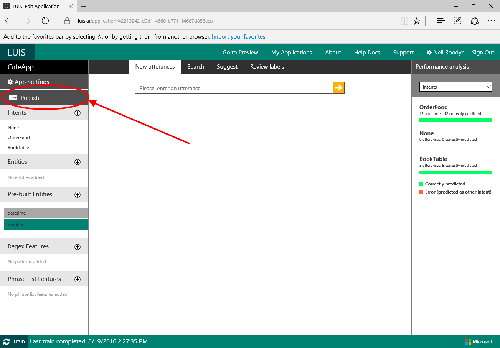
   Figure 13 Publish the App

16. In order to use the LUIS app from your Bot you will need an Azure subscription key. It is assumed you have an Azure account. If not you can sign up for a trial account. 
To create a new subscription key for your LUIS service Sign in to the [Azure Portal](https://ms.portal.azure.com/) In the top left side of the page click the New link.

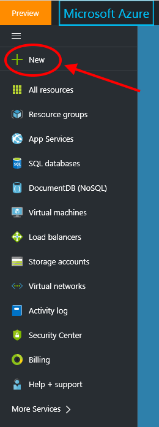
   Figure 14 A a new Azure resource

17. In the search box enter *Cognitive Services* and select the Cognitive Services APIs, then click the Create button to create 

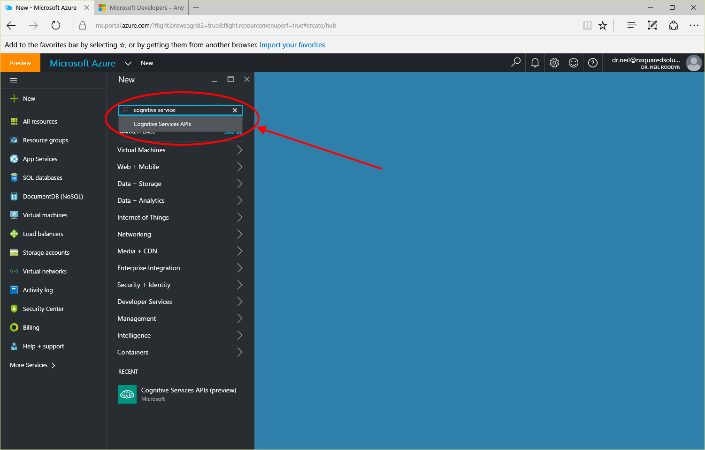
   Figure 15 Find the Cognitive Services APIs

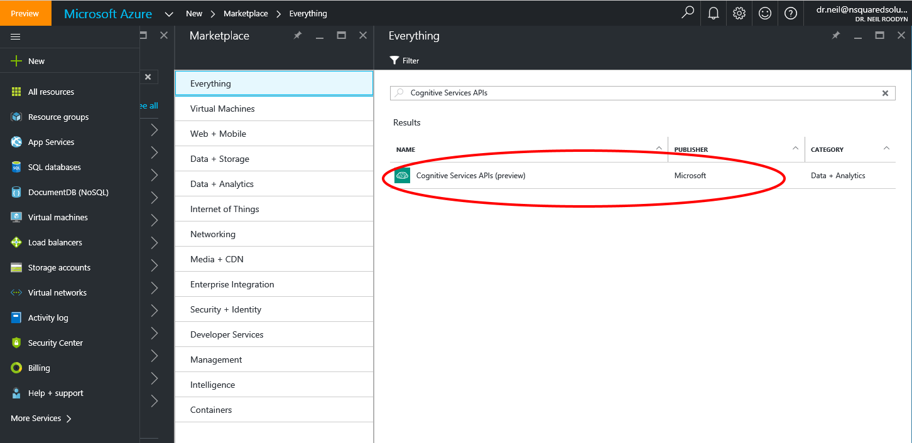
   Figure 16 Select the Cognitive Services APIs

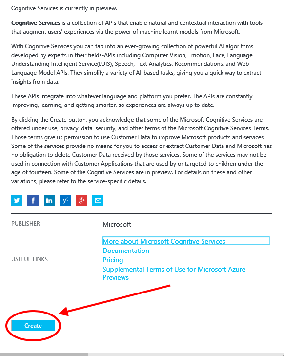
   Figure 17 Create the Cognitive Services 

18. On the Create page, enter a name for the service, this is be for you to identify, then select the API type. You need to select the LUIS API.

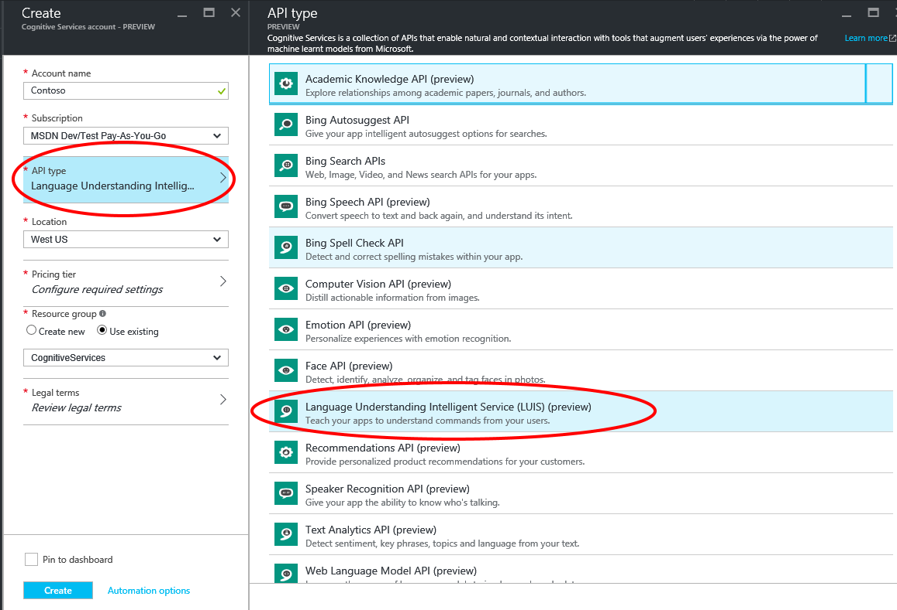
   Figure 18 Select the LUIS API 

19. Select a pricing tier, The free tier is fine for this exercise. Then select the legal terms and ensure you agree. Then you can click on **Create**. 

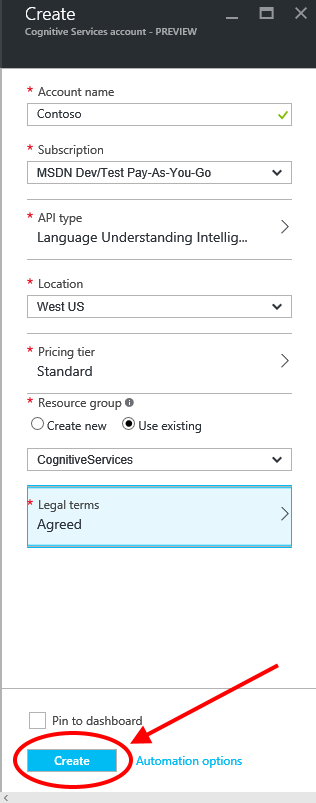
   Figure 19 Create the LUIS service 

20. You now need to find the service you created and get a subscription key to use with your LUIS app. In the Azure Portal search your resources for the service you just created. Then select the **All Settings** button and then click on the **Keys**. You should see you have two keys, copy the first key to your clipboard, you will need that shortly.

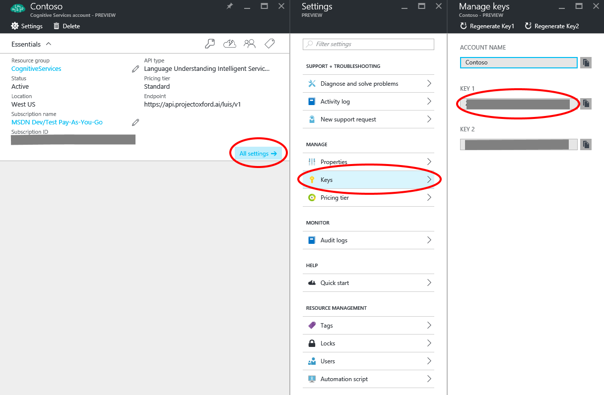
   Figure 20 Get an Azure Subscription Key

21. Return to the LUIS portal and under your name in the top right you will see **My Settings**. Click on **My Settings** and then click on the **Subscription Keys** button. You will now see a location to enter the subscription key you copied from the Azure portal. Paste the key into the text box and select **Add Key**
Key a copy of this key somewhere handy, you will need it again soon.

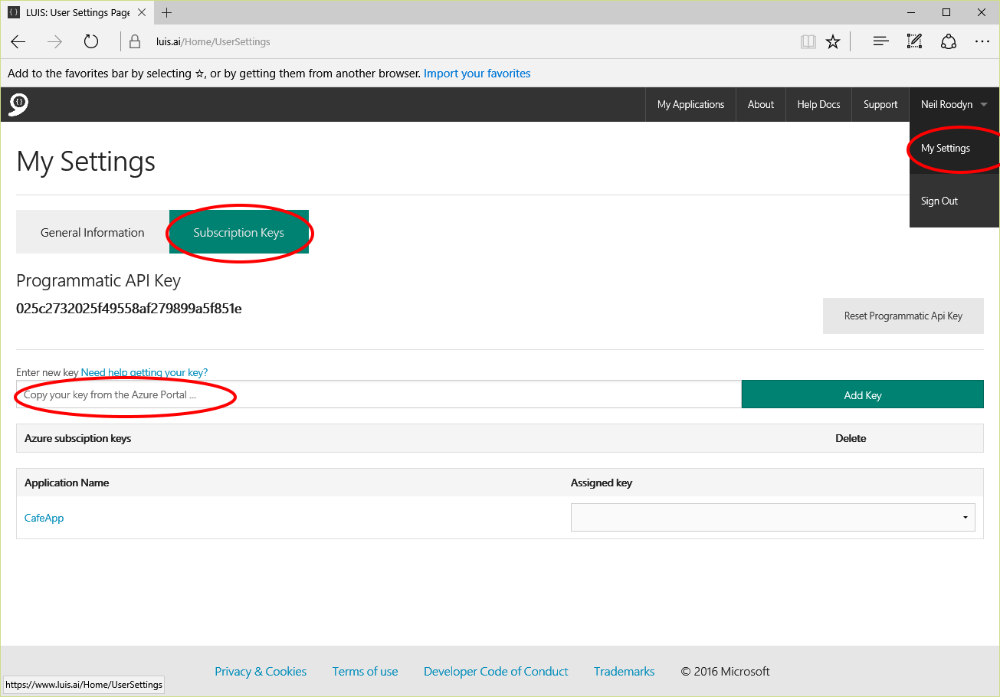
   Figure 21 Enter the Azure Subscription Key into the LUIS Portal

22. You will also need the  App ID of your LUIS app to use in the code you are going to add to your Bot. Still in the LUIS Portal select your application and in the top left of the page click on **App Settings**. A dialog will display the App Id for your app, make a copy of this also, you will need it again soon.

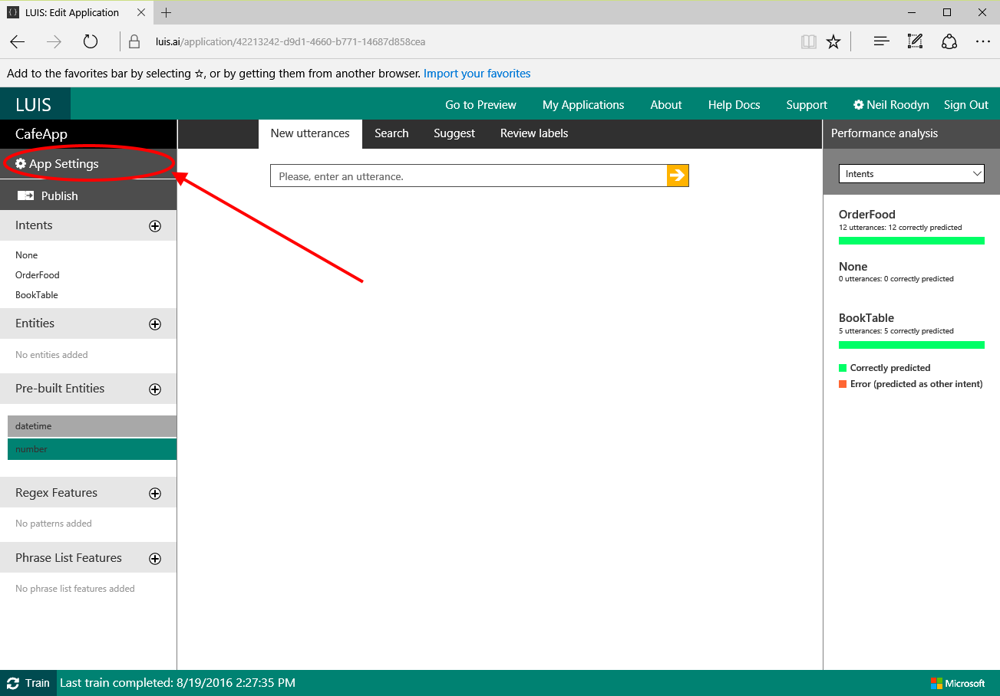
   Figure 22 Get the App Settings

You have now created a LUIS service for two actions, OrderBook, and BookTable. The next step is to integrate that service into a conversational Bot. You will use the Contoso Cafe Bot. 

23. Open the CafeBot in Visual Studio. You can either start from the Bot you built in the tutorial to build the CafeBot or you can use the code provided wiht this tutorial.

24. In **Solution Explorer** right click on the Models folder and select **Add | Class**

25. Nsme the class *Command*

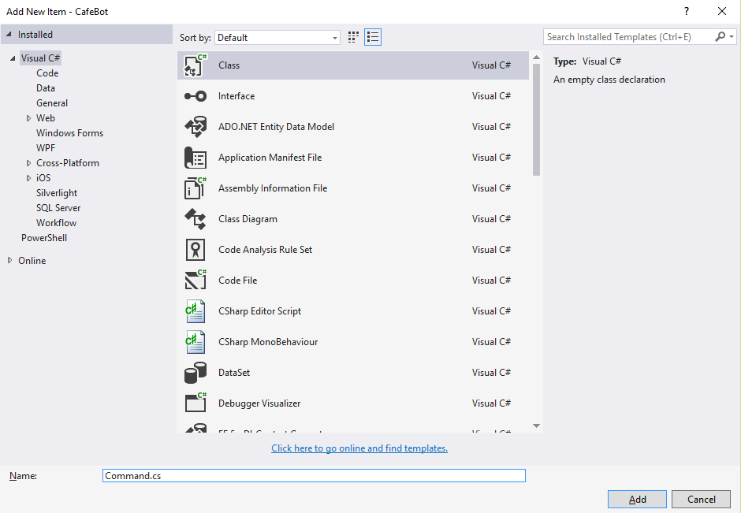
   Figure 23 Add the Command model class

26. Edit the code in the Cammand class to add a new enum named CommandType and some member fields of the Command class. You will use this class to determine the actions requested by the person chatting with the Bot.

```cs

namespace CafeBot.Models
{
    public enum CommandType
    {
        None,
        OrderFood,
        BookTable
    }

    public class Command
    {
        public CommandType CommandType;
        public string Time;
        public string Date;
        public int Guests;
    }
}
```

27. Open the OrderFood.cs class. If you followed the other tutorial to build this Bot you may recall that this class is no longer used. We will use it now to capture the intent of a command given by someone chatting to the Bot. 
At the top of the class add three using statements

```cs
using Microsoft.Bot.Builder.Luis;
using Microsoft.Bot.Builder.Luis.Models;
using CafeBot.Models;
```

28. Change the class to inherit from the LuisDialog class and add the LuisModel attribute to the class. The two items you copied when you were making the Luis App and Azure subscription are now needed. Paste the LUIS app id and the Azure subscription key into this LuisModel attribute.

```cs
    [LuisModel("YOUR LUIS APP ID", "YOUR AZURE SUBSCRIPTION KEY")]
    [Serializable]
    public class OrderFood : LuisDialog<Command>
    {
```

29. Add three string constants to the OrderFood class, these will be used to determine if the entities (pre-built) that you added to the LUIS model are present in the request.

```cs
    public const string Entity_datetimeDate = "builtin.datetime.date";
    public const string Entity_datetimeTime = "builtin.datetime.time";
    public const string Entity_number = "builtin.number";
```

30. Add a method to the OrderFood class to handle the OrderFood intent. You will notcie that the plumbing for this is done for you, you simply need to add the attribute LuisIntent and the method will be called if the intent is detected in the dialog.

```cs
    [LuisIntent("OrderFood")]
    public async Task Order(IDialogContext context, LuisResult result)
    {
        Command cmd = new Command() { CommandType = CommandType.OrderFood };
        EntityRecommendation time;
        EntityRecommendation date;

        if (result.TryFindEntity(Entity_datetimeTime, out time))
        {
            cmd.Time = time.Entity;
        }

        if (result.TryFindEntity(Entity_datetimeDate, out date))
        {
            cmd.Date = date.Entity;
        }

        context.Done(cmd);
    }
```

31. Add a method to handle the BookTable intent.These methods are creating a Command object and filling the fields with entity values detected by the LUIS app. 

```cs
    [LuisIntent("BookTable")]
    public async Task Booking(IDialogContext context, LuisResult result)
    {
        Command cmd = new Command() { CommandType = CommandType.BookTable };

        EntityRecommendation date;
        EntityRecommendation time;
        EntityRecommendation guests;
        
        if (result.TryFindEntity(Entity_datetimeTime, out time))
        {
            cmd.Time = time.Entity;
        }

        if (result.TryFindEntity(Entity_datetimeDate, out date))
        {
            cmd.Date = date.Entity;
        }

        if (result.TryFindEntity(Entity_number, out guests))
        {
            cmd.Guests = int.Parse(guests.Entity);
        }

        context.Done(cmd);
    }
```

32. Add a final method to the OrderFood class to handle the case when no intent is detected.

```cs
    [LuisIntent("")]
    public async Task None(IDialogContext context, LuisResult result)
    {
        string message = $"Sorry I did not understand: " + string.Join(", ", result.Intents.Select(i => i.Intent));
        await context.PostAsync(message);
        Command c = new Command() { CommandType = CommandType.None };
        context.Done(c);
    } 
```

33. Open the MessagesController.cs code file and edit the MakeRootDialog method to use the OrderFood dialog you just edited. The intent detected in the OrderFood dialog is used in the conversation to determine if the customer desires to book a table or order food.

```cs
internal static IDialog<string> MakeRootDialog()
        {
            return Chain.From(() => new OrderFood())
                .Switch(
                    new Case<Command, IDialog<string>>((cmd) =>
                    {
                        return (cmd.CommandType == CommandType.OrderFood);
                    }, (ctx, cmd) =>
                    {
                        ctx.PostAsync($"Welcome to the Contoso Cafe, are you ready to order?");
                        return Chain.ContinueWith(FormDialog.FromForm(BuildOrderForm),
                            async (c, r) =>
                            {
                                Order o = await r;
                                return Chain.ContinueWith<Delivery, string>(new DeliveryDialog(o),
                                    (async (ct, rs) =>
                                {
                                    Delivery d = await rs;
                                    return Chain.From(()=>new  CompletedDialog(d));
                                }));
                            });
                    }),
                    new Case<Command, IDialog<string>>((cmd) =>
                    {
                        return (cmd.CommandType == CommandType.BookTable);
                    }, (ctx, cmd) =>
                    {
                        string booking = $"Thank you for your booking";
                        if (cmd.Guests > 0)
                        {
                            booking += $" for {cmd.Guests} guests";
                        }
                        if (null != cmd.Time)
                        {
                            booking += $" at {cmd.Time}";
                        }
                        if (null != cmd.Date)
                        {
                            booking += $" {cmd.Date}";
                        }
                        return Chain.Return(booking); 
                    }),
                    new DefaultCase<Command, IDialog<string>>((ctx, cmd) =>
                    {
                        return Chain.Return($"I can help you with ordering food or booking a table");
                    })
                )
                .Unwrap()
                .PostToUser()
                ;
                
        }
```

34. For this to work you need ot make a small edit to the CompletedDialog class. The class currently returns a Delivery. It needs to return a string to comply with the protocols setup by the code you just edited.
Open the CompletedDialog.cs code file and edit is as follows.
Change the templated type that IDialog returns to string and change the result passed into content.Done to the response string 

```cs
public class CompletedDialog : IDialog<string>
```

```cs
    public async Task StartAsync(IDialogContext context)
    {
        string response = $"Thank you for your order";
        await context.PostAsync(response);
        if (delivery.Order.DeliveryOption == DeliveryOption.Pickup)
        {
            response = $"It will be ready for collection in 20 minutes";
        }
        else
        {
            response = $"It will be delivered to {delivery.Address} within the next 45 minutes";
        }
        await context.PostAsync(response);
        context.Done(response);
    }
```

35. Compile and run the BOT in Visual Studio (F5). Then in the Bot Emulator ask to order food or book a table. You will see that you have built some intelligent conversational capabilty into this Bot very quickly.


   Figure 24 Chat to the Bot in the emulator.


In this document you have learned how to create a language model in a LUIS app. You have discovered how to specify an intent so that actions in your software can be triggered from a natural language command. You have also learned how to isolate important parts of a phrase as Entities that can be used in your software.
You then applied the LUIS app to the Contoso Cafe Bot to determine if the customer is asking to order food or book a table. 

**Exercises to extend this Bot.**

1. Use the Entity information in the Command object to change the behviour of the Delivery object.

2. Add a custom Entity to determine if the food ordered is for pickup or delivery.

3. Add a new Intent for customers to order a cake for an event.
 


_References and Links_

[The main LUIS site](https://www.luis.ai/)

[Getting started with LUIS](https://www.microsoft.com/cognitive-services/en-us/luis-api/documentation/getstartedwithluis-basics)

[Language Intelligence With Bots](https://docs.botframework.com/en-us/bot-intelligence/language/#navtitle)


